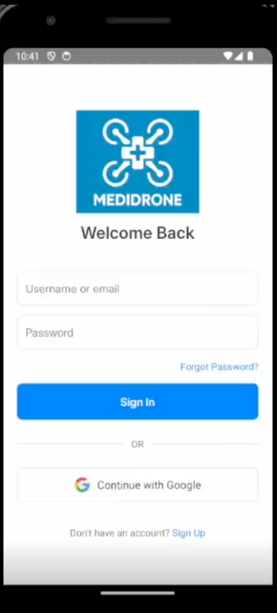

# Autonomous Drone Assistance for Medical Emergencies

---

## Overview

This project introduces an AI-powered emergency medical response system that integrates autonomous drone delivery, voice-activated mobile communication, and real-time clinical triage support. Designed for rapid deployment in rural and underserved areas, the system provides an efficient pipeline from patient alert to treatment recommendation and medical supply delivery.

[Academic Report](https://github.com/Lelekhoa1812/Triage-LLM-Based/tree/main/Report.pdf)  
[Demo Videos](https://liveswinburneeduau-my.sharepoint.com/:f:/g/personal/103218929_student_swin_edu_au/EotHYiTFYlhPpEdWdFAREFEBu80GqF204BaKHzSeWEQGmw?e=r0z6B9)

---

## System Architecture

The architecture comprises four major components:

---

### 1. Mobile Application (React Native)

Cross-platform application for patients to:

* Trigger emergencies using voice input (transcribed by Whisper-v3)
* Access and manage their medical profiles
* Upload prescriptions and reports (OCR processed using Qwen2.5-VL)
* Scan QR for secure drone delivery verification

**Credential Screen**
<div align="center">
  
</div>


**Chatbot Screen**
<table>
  <tr>
    <td></td>
    <td></td>
  </tr>
  <tr>
    <td align="center"></td>
    <td align="center"></td>
  </tr>
</table>


**Medical Profile Screen**
<table>
  <tr>
    <td></td>
    <td></td>
  </tr>
  <tr>
    <td align="center"></td>
    <td align="center"></td>
  </tr>
</table>


**Emergency Request Screen**
<table>
  <tr>
    <td></td>
    <td></td>
  </tr>
  <tr>
    <td align="center"></td>
    <td align="center"></td>
  </tr>
</table>


**QR Wallet Screen**
<div align="center">
  
</div>

---

### 2. Triage Web Portal (React)

Hospital-side interface offering:

* Emergency alert dashboard with LLM-driven suggestions
* Severity classification and dispatch control (drone/ambulance)
* Emergency log visualization (charts + history)
* Drone live status tracking
* Communication modules to notify nearby hospitals

**Web Portal**  
  
  
  

[Access site](https://dispatch-portal-amber.vercel.app)  

---

### 3. Backend Architecture (FastAPI)

Two containerized microservices deployed on Hugging Face Spaces:

#### RAG Service

* User onboarding, authentication, and medical history embedding
* OCR document summarization using Qwen2.5-VL
* FAISS-based patient vector index stored in MongoDB

[Endpoint](https://huggingface.co/spaces/BinKhoaLe1812/Medical_Profile)

#### Triage Service

* Voice transcription with Whisper-large-v3
* Contextual retrieval from MIMIC-IV v3.1 embedded QA dataset (364K+ patients)
* Gemini 2.5 Pro generates treatment recommendations and medication suggestions
* JSON-based dispatch instructions delivered to hospital systems

**Dashboard**  
  

[Endpoint](https://huggingface.co/spaces/BinKhoaLe1812/Triage_LLM)
[Dashboard](https://binkhoale1812-triage-llm.hf.space/)

---

### 4. Drone System (Great Shark 330 PRO VTOL)

* Simulated with ArduPilot for waypoint navigation
* Supports 10kg payload and real-time delivery visualization
* QR code delivery verification logic (secured by user token + face-ID/PIN - prototype pending)

**Drone Simulation**


---

## Technologies Used

* **Languages/Frameworks:** Python, FastAPI, JavaScript, React, React Native, NodeJS
* **AI Models:** Whisper-v3, Gemini 2.5 Pro, MiniLM, Qwen2.5-VL
* **Databases:** MongoDB Atlas + GridFS
* **Search & Retrieval:** FAISS
* **Deployment:** Docker, Hugging Face Spaces, Vercel
* **Dev Tools:** psutil, transformers, sentence-transformers, gradio\_client

---

## Dataset

* **MIMIC-IV v3.1**: Integrated as the triage QA source. Covers 65K ICU and 200K ED cases from Beth Israel Deaconess Medical Center. [Available here](https://physionet.org/content/mimiciv/3.1/)

## How It Works

1. **User triggers an emergency** via mobile app voice input
2. **Voice is transcribed** by Whisper and merged with user profile context
3. **FAISS retrieves** top 3 similar MIMIC-IV triage cases
4. **Gemini LLM generates** structured output (actions, medication, severity)
5. **Suggestions are visualized** in hospital portal, and human-in-the-loop decides next action (dispatch or escalate)

**Architecture Explained**


---

## Installation

To run backend locally:

```bash
git clone https://github.com/Lelekhoa1812/Triage-LLM-Based
cd backend
pip install -r requirements.txt
uvicorn app:app --reload --port 7860
```

---

## Contributors

* Dang Khoa Le
* Liam Edmonds-Seng
* Aarush Singh
* Erfan Mangani

---

## License

© 2024 Swinburne University of Technology – Licensed for academic and research use only.
